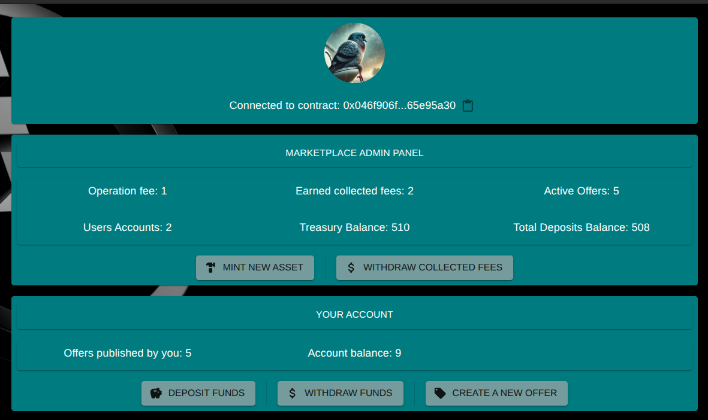
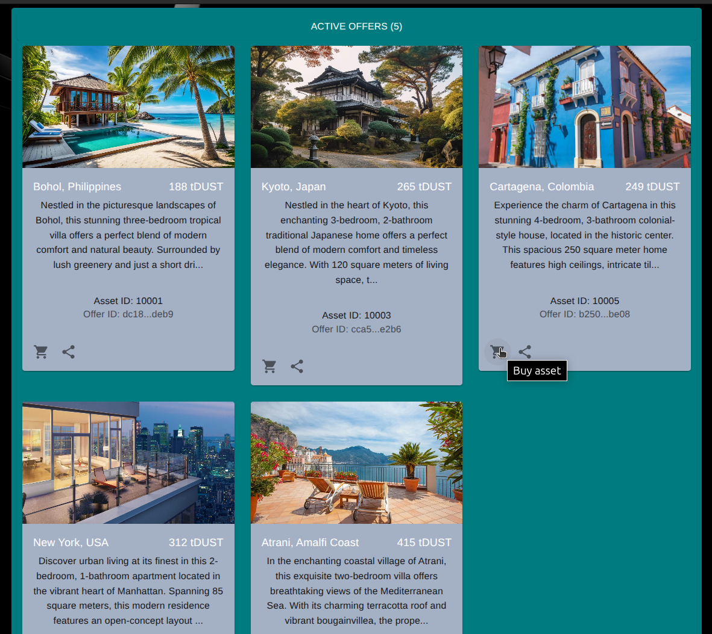
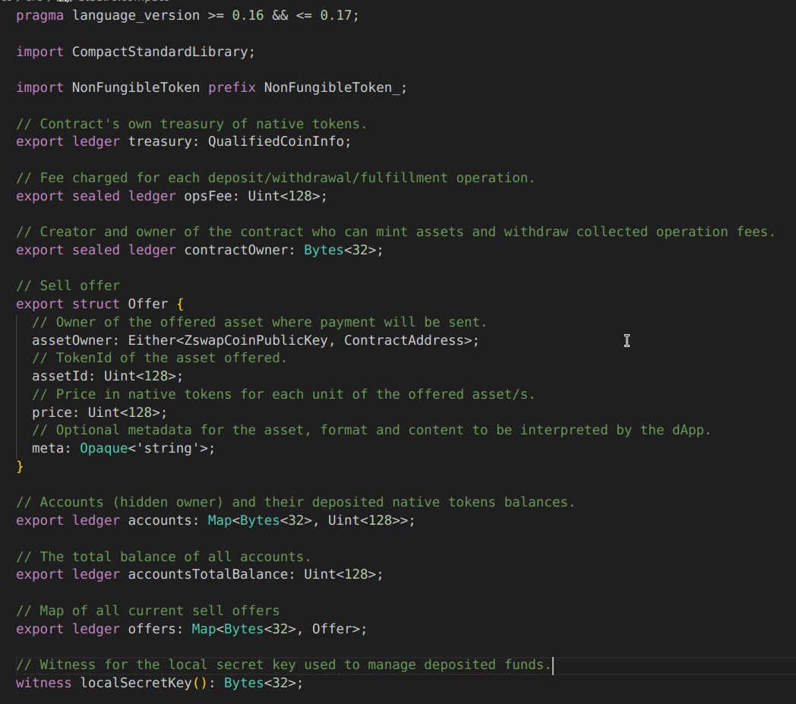

# Ataulfo dApp

## The RWA Marketplace Committed to Your Privacy


Ataulfo is a decentralized application (dApp) for creating and managing a Real World Asset (RWA) marketplace on the [Midnight](https://midnight.network/) blockchain. It provides both a command-line interface (CLI) and a graphical user interface (GUI) for interacting with a deployed Ataulfo smart contract.

An example Ataulfo marketplace has been deployed on Midnight Testnet network at the following address: `020079046f906f3ac5888ceb4b2790d82065101e7590b650787ad7116d4165e95a30`

Users can interact with the marketplace using either a command-line interface (CLI) or a graphical user interface (GUI), as detailed in the subsequent instructions. This information is useful for developers or testers who want to connect to and experiment with the deployed marketplace without needing to set up their own instance.





---

## Features

- **Deploy or Join a Marketplace:** Deploy a new Ataulfo contract or join an existing one using its contract address.
- **Operation Fee:** The deployer defines the contract operations fee. The contract charges a fee in `tDUST` for each deposit, withdrawal, or when fulfilling an offer.
- **Mint Assets:** The contract deployer can mint new NFT assets representing real-world items.
- **Create Offers:** List assets for sale, including metadata such as location, description, and image URL.
- **Support for Real Estate Agencies:** RWA asset owners and approved operators (e.g., real estate agencies) can publish offers.
- **Deposit Funds:** Users deposit `tDUST` into their marketplace account, required to buy offered RWAs.
- **Withdraw Funds:** Users can withdraw all or part of their deposited `tDUST` at any time to their connected wallet.
- **Buy/Fulfill Offers:** Purchase assets listed by others. When an offer is fulfilled, payment is sent directly from the buyer’s marketplace funds to the publisher’s wallet, and the asset is automatically transferred to the buyer’s wallet.
- **Cancel Offers:** Offers can be cancelled by the publisher or the owner if the publisher was an operator or approved party.
- **Withdraw Collected Fees:** Contract owners can withdraw operation fees collected from marketplace activity, while maintaining enough balance to back user deposits.
- **State Synchronization:** Both CLI and GUI keep users in sync with the contract state on the Midnight blockchain.

---

## Caveats

- The list of assets (NFTs) owned by a user is currently not displayed in the UI/CLI. To publish an asset on the marketplace, users need to know their asset/NFT ID. The asset IDs are chosen by the contract owner when minting them.
- Currently, RWA/NFT assets offered in the marketplace are not transferred to the contract, as this is not yet supported by Midnight. Instead, the contract is approved to transfer the asset when an offer is made.

---

## How It Works with Midnight Smart Contracts

Ataulfo leverages the [Midnight](https://midnight.network/) smart contract platform:

- Contract logic is defined in [contract/](contract/) and compiled to run on Midnight.
- The API in [api/](api/) provides a TypeScript interface to interact with the deployed contract, handling serialization, transaction creation, and state queries.
- The CLI ([cli/](cli/)) and GUI ([gui/](gui/)) both use this API to interact with the contract for deploying, joining, or performing marketplace actions.
- All sensitive operations (minting, buying, withdrawing, etc.) are executed as zero-knowledge transactions on Midnight, ensuring privacy and security.

---

## Privacy Features

Ataulfo is built on the Midnight blockchain, designed for privacy-preserving smart contracts. All sensitive operations—such as minting assets, creating offers, fulfilling offers, and managing balances—are executed as zero-knowledge transactions. This ensures that details (offer owners, user balances, etc.) remain private and are visible only to authorized parties.

---

## Prerequisites

- [Node.js](https://nodejs.org/) (v18+ recommended)
- [npm](https://www.npmjs.com/) or [yarn](https://yarnpkg.com/)
- [Docker](https://www.docker.com/) for running the [local proof server](https://docs.midnight.network/quickstart/builder-quickstart#install-docker-desktop) as instructed in the Midnight Network documentation.
- [Midnight Lace wallet](https://chromewebstore.google.com/detail/lace-beta/hgeekaiplokcnmakghbdfbgnlfheichg) browser extension (for GUI usage).
- [Compact developer tools](https://docs.midnight.network/blog/compact-developer-tools).
---

## Project Structure

```text
api/        # TypeScript API for interacting with the Ataulfo contract
cli/        # Command-line interface for power users and testing
contract/   # Smart contract source code (Midnight/Compact)
gui/        # React-based web UI for end users
```

---

## Getting Started

### 1. Clone the Repository

```sh
git clone https://github.com/bochaco/ataulfo.git
cd ataulfo
```

### 2. Install Dependencies

Install dependencies for all packages:

```sh
npm install
# or, if using yarn:
# yarn install
```

### 3. Build the Ataulfo contract

Install the Compact toolchain, the dependencies, and compile the contract:

```sh
cd contract
npm install
curl --proto '=https' --tlsv1.2 -LsSf https://github.com/midnightntwrk/compact/releases/latest/download/compact-installer.sh | sh
npm run compact
```

### 4. Run the Midnight proof server

Follow the Midnight [documentation to start the local proof server](https://docs.midnight.network/quickstart/builder-quickstart#set-up-the-proof-server).

### 5. Running the CLI with Testnet

To connect to the Midnight public testnet:

```sh
cd cli
npm install
npm run testnet-remote
```

### 6. Running the GUI with Testnet

- Start the Backend Server
```sh
cd gui
npm install
npm run build:start
```
- Open [http://localhost:8080](http://localhost:8080) in your browser.
- Ensure you have the [Midnight Lace wallet extension](https://chromewebstore.google.com/detail/lace-beta/hgeekaiplokcnmakghbdfbgnlfheichg) installed and connected.

---

## License

This project is licensed under the Apache License 2.0. See [LICENSE](LICENSE) for details.

---

For more details, see the code in each package and the inline documentation.
